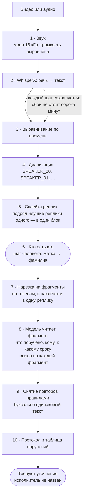

# protocall

Протокол видеосовещания с поручениями: распознавание речи с разделением по
говорящим и извлечение поручений локальной языковой моделью.

На вход — запись совещания. На выходе — стенограмма с именами участников,
список поручений с исполнителями и сроками и готовый протокол.

**Всё считается на своей машине.** Ни запись, ни стенограмма никуда не
уходят: распознавание идёт локальными моделями, а языковая модель работает
рядом, через Ollama или LM Studio. Для совещаний, где обсуждают внутренние
дела, это не приятная мелочь, а условие, при котором инструментом вообще
можно пользоваться.

## Как устроено

| Шаг | Что происходит |
|---|---|
| 1 | Из видео извлекается звук: моно, 16 кГц — то, что нужно распознаванию |
| 2 | WhisperX превращает речь в текст и выравнивает его по времени |
| 3 | Диаризация делит запись по говорящим: `SPEAKER_00`, `SPEAKER_01`, … |
| 4 | Подряд идущие реплики одного человека склеиваются в связные блоки |
| 5 | Метки говорящих сопоставляются с реальными участниками |
| 6 | Стенограмма режется на куски под окно модели |
| 7 | Модель извлекает из каждого куска поручения: кому, что, к какому сроку |
| 8 | Поручения сводятся в один протокол |

## Как проходят данные



Модель вызывается столько раз, сколько получилось фрагментов: на часовом
совещании с окном в 8k это обычно четыре-шесть запросов. Сводятся их
результаты **не моделью, а правилами** — тем и объясняется, что повторы
снимаются только буквальные.

### Нарезка нужна не всегда

Она существует ровно потому, что стенограмма не влезает в окно модели. Из
этого растёт и всё остальное: нахлёст — чтобы не терять поручение, разбитое
на две реплики на границе фрагментов; снятие повторов — чтобы нахлёст не
двоил результат.

Размер окна задаётся параметром `llm_context_tokens`, и от него всё зависит:

| Окно | Что происходит |
|---|---|
| 8k, местная 7B | 4–6 фрагментов, нахлёст, снятие повторов |
| 32k | один-два фрагмента |
| 128k и больше | фрагмент один: часовое совещание это тысяч двадцать токенов |

При большом окне модель видит весь разговор сразу: повторов не возникает по
построению, и контекст у неё полный — она понимает, что «план по
справочникам» в начале и в конце это одно и то же поручение.

Соблазн очевиден, и всё же по умолчанию здесь местная модель с тесным окном.
Большое окно сегодня означает облако, а инструмент обещает, что запись и
стенограмма не покидают машину. Для совещания с внутренней кухней это не
украшение, а условие допуска: отправить стенограмму наружу — значит отменить
единственную причину, по которой инструментом можно пользоваться.

Поэтому окно — параметр, а не выбор архитектуры. Код один и тот же.

### Что вытягивает малую модель

Если цель — обойтись местной 7B, помогает вот что, по убыванию отдачи:

* **Пример в промпте.** Малая модель держит формат заметно устойчивее, когда
  видит образец ответа. Он в промпте есть, и в нём нарочно показано
  поручение без исполнителя — чтобы «не указано» выглядело допустимым
  ответом, а не поводом выдумать фамилию.
* **Фрагменты поменьше.** Против интуиции: на длинном куске малая модель
  начинает терять поручения из середины. Для этого и оставлен
  `chunk_max_tokens` — задать бюджет вручную, меньше расчётного.
* **Строки вместо JSON.** Структуру она ломает на первом же длинном тексте,
  а `Поручение: … Кому: … Срок: …` держит.
* **Низкая температура.** Задача извлекающая: поручение надо найти в тексте,
  а не сочинить похожее.

## Что получается

Протокол на выходе выглядит так — это настоящий вывод на синтетическом
совещании из `data/sample`:

```markdown
# Протокол рабочего совещания

**Дата:** 05.06.2025, 11:00
**Место:** Переговорная 3
**Председатель:** Орлов В.П.
**Участники:** Орлов В.П., Сергей Ким, Тимур Асанов, Анна Лебедева

## Поручения

| № | Поручение | Исполнитель | Срок |
|---|---|---|---|
| 1 | Подготовить план работ по выгрузке справочников | Сергей Ким | до пятницы |
| 2 | Развернуть демонстрационный стенд на тестовом контуре | Тимур Асанов | к среде |
| 3 | Направить черновик инструкции участникам | Анна Лебедева | до конца недели |

### Требуют уточнения

Прозвучали, но исполнитель не назван:

- Собрать справку по инцидентам за квартал
```

Последний раздел — не украшение. На совещании регулярно звучит «надо собрать
справку», а кому — не говорят. Такое поручение нельзя ни выбросить, ни
приписать наугад: секретарь должен увидеть его отдельно и уточнить.

Рядом с протоколом выгружается таблица поручений: её разбирают по
исполнителям и ставят на контроль.

## Три шага, и средний из них ваш

Приложение не делает всё по одной кнопке намеренно. Между распознаванием и
протоколом человек обязан вмешаться: модель слышит, что говорят разные люди,
но не знает их имён. Сопоставить `SPEAKER_00` с фамилией может только тот,
кто был на совещании, — по голосу, по содержанию, по порядку выступлений.

Метку, оставленную без имени, инструмент не трогает: она попадёт в протокол
как есть. Это лучше, чем чужая фамилия под чужими словами.

## Что нужно из железа

Здесь стоит быть прямым: это не веб-приложение, которое запускается на любом
ноутбуке.

**Видеокарта NVIDIA с CUDA** — для распознавания она нужна практически
обязательно. Час совещания на процессоре моделью `medium` считается часами;
на видеокарте — минуты. Диаризация без CUDA тем более мучительна.

**Для языковой модели видеокарта нужна не формально, а по времени.** Ollama
и LM Studio запускаются и на процессоре, и на Apple Silicon через Metal, но
модель на 7 миллиардов параметров на процессоре отвечает десятками секунд на
запрос, а запросов на часовое совещание — десятки. Считайте, что без
видеокарты это работает, но пользоваться этим нельзя.

Ориентиры: 8 ГБ видеопамяти под модель 7B в кванте, 16 ГБ комфортно; 16–32 ГБ
оперативной памяти; от 40 ГБ на диске под модели.

## Установка

Если нужен только порядок действий, без объяснений — есть отдельная памятка
на одну страницу: [QUICKSTART.md](QUICKSTART.md).


```bash
pip install -e ".[asr,app]"
```

Понадобится `ffmpeg` в системе — им извлекается звук из видео.

### Токен HuggingFace

Модели диаризации закрытые: без токена их не отдадут. Настраивается это один
раз и в таком порядке.

**Токен у каждого свой.** Он привязан к аккаунту HuggingFace и заменяет
собой пароль: по нему видно, кто и когда скачивал модели, и с ним можно
действовать от вашего имени. Общий токен на отдел — плохая идея по трём
причинам: его нельзя отозвать, не сломав работу всем сразу; непонятно, чей
именно он утёк; и условия моделей pyannote принимает конкретный человек, а
не организация. Заведите свой — это две минуты.

**Сначала примите условия моделей** — это важнее самого токена, потому что
без согласия он не поможет. Под своим аккаунтом откройте и нажмите согласие:

* `huggingface.co/pyannote/speaker-diarization-3.1`
* `huggingface.co/pyannote/segmentation-3.0`

Нужны обе: вторая тянется как зависимость первой. В старых версиях WhisperX
это `pyannote/speaker-diarization` и `pyannote/segmentation`, без номеров.

**Создайте токен** на `huggingface.co/settings/tokens`, тип **Read**. Больше
прав не нужно: диаризация только читает.

**Положите его в окружение.** Linux и macOS:

```bash
echo 'export HF_TOKEN=hf_...' >> ~/.zshrc && source ~/.zshrc
```

Windows, PowerShell — с перезапуском терминала после:

```powershell
setx HF_TOKEN "hf_..."
```

Проверить, что переменная видна:

```bash
python -c "import os; print('токен есть' if os.environ.get('HF_TOKEN') else 'токена нет')"
```

**В файл настроек и тем более в код токен класть нельзя.** Однажды попавший
в репозиторий, он считается скомпрометированным, даже если репозиторий
приватный, и его придётся отзывать. Проверить, не утёк ли, можно там же, в
настройках аккаунта: у токена показано, когда им пользовались в последний
раз — и обращение отмечается при каждом запуске диаризации, а не только при
скачивании моделей.

**Если модели уже скачаны**, можно вообще не ходить в сеть: параметр
`offline_models` включает `HF_HUB_OFFLINE`, и повторные запуски перестают
обращаться к HuggingFace.

Языковая модель поднимается отдельно:

```bash
ollama serve
ollama pull mistral
```

## Из кода

```python
from protocall.config import Settings
from protocall.pipeline import Meeting, process, save

protocol = process(
    "data/input/meeting.mp4",
    Settings(asr_model="medium", speakers=4),
    meeting=Meeting(
        title="Протокол рабочего совещания",
        date="05.06.2025, 11:00",
        names={"SPEAKER_00": "Орлов В.П.", "SPEAKER_01": "Сергей Ким"},
    ),
)
save(protocol, "data/output")
```

Распознавание и сборку протокола можно развести: первое требует видеокарты,
второе — нет. Стенограмма сохраняется в json, и по ней протокол
пересобирается на любой машине, хоть с другими именами участников.

```python
from protocall.pipeline import protocol_from_transcript, transcribe_meeting

transcript = transcribe_meeting("meeting.mp4")            # нужна видеокарта
protocol = protocol_from_transcript(transcript)           # достаточно ноутбука
```

## Из командной строки

Интерфейс удобнее для одной записи. Командная строка — когда записей
десяток, когда всё должно идти по расписанию, или когда браузер на машине
открывать не хочется.

```bash
protocall check                      # доступ к моделям и связь с LLM
protocall recognize meeting.mp4      # запись -> стенограмма (нужна видеокарта)
protocall protocol segments.json \
    --name SPEAKER_00="Орлов В.П." \
    --name SPEAKER_01="Сергей Ким" \
    --date "05.06.2025, 11:00"       # стенограмма -> протокол (видеокарта не нужна)
protocall run meeting.mp4            # всё разом
```

Команд четыре, а не одна, по той же причине, по которой в интерфейсе три
шага. `recognize` печатает найденные метки говорящих и подсказывает готовую
строку для следующего шага — наизусть их всё равно никто не помнит.

`check` возвращает ненулевой код, если что-то не настроено: годится для
проверки перед пакетным запуском.

`recognize` печатает ход работы по шагам — в терминале это единственный
признак жизни, потому что часовая запись считается десятки минут молча:

```
  [ 65%] Распознаю речь — 812.4 с
  [ 80%] Выравниваю по времени — 96.1 с
  [100%] Разделяю по говорящим — 233.7 с
```

Шкала грубая: доли шагов взяты из наблюдений, а не измеряются. Точнее не
выйдет — WhisperX не сообщает, сколько минут записи он уже прошёл. Но и
такая честнее крутилки, по которой не понять, идёт работа или всё повисло.

Без установки пакета то же самое доступно как `python -m protocall`.

## Из чего состоит

| Модуль | Отвечает за |
|---|---|
| `protocall.audio` | звук из видео: моно 16 кГц, выравнивание громкости |
| `protocall.transcribe` | WhisperX: распознавание, выравнивание, разделение по говорящим |
| `protocall.blocks` | склейка реплик, нормализация меток, имена участников |
| `protocall.chunking` | нарезка стенограммы под окно модели, с нахлёстом |
| `protocall.llm` | запросы к локальной модели по OpenAI-совместимому протоколу |
| `protocall.tasks` | промпты и разбор ответа: что поручено, кому, к какому сроку |
| `protocall.protocol` | сборка документа и таблицы поручений |
| `protocall.pipeline` | всё перечисленное по порядку |
| `protocall.cli` | командная строка: check, recognize, protocol, run |

Тяжёлое вынесено на края. Ядро — склейка реплик, нарезка, разбор ответа,
сборка протокола — работает без видеокарты, без моделей и без запущенной
LLM, и проверяется тестами целиком.

## Что стоит знать заранее

**Диаризация ошибается.** Она может разделить одного человека на двух — так
бывает, когда он отходит от микрофона, — или свести двоих в одного. Первое
лечится на шаге сопоставления: назначьте обеим меткам одно имя, и реплики
сольются. Второе не лечится ничем, кроме перезаписи с лучшим микрофоном.

**Реплика без метки не выбрасывается.** Если диаризация не опознала кусок,
он остаётся в стенограмме под меткой `UNKNOWN`. В списке участников его нет
и модели он как человек не предъявляется — но текст сохраняется, потому что
в нём вполне может быть суть поручения.

**Модель может придумать.** У каждого поручения сохраняется номер фрагмента,
из которого оно взято, — по нему возвращаются к месту разговора и проверяют.
Протокол, собранный автоматически, остаётся черновиком до вычитки.

## Настройки

`config.yaml` рядом с проектом, необязательный. Любое поле переопределяется
переменной окружения с префиксом `PROTOCALL_`.

| Параметр | Что значит |
|---|---|
| `asr_model` | размер модели Whisper: `tiny`…`large-v3` |
| `language` | язык записи |
| `speakers` | сколько человек говорит; пусто — определить самой |
| `offline_models` | не ходить в HuggingFace, если модели уже скачаны |
| `llm_context_tokens` | окно модели; отсюда считается размер фрагмента |
| `chunk_max_tokens` | бюджет фрагмента вручную; пусто — считать от окна |
| `chunk_overlap_blocks` | сколько реплик повторить на границе кусков |
| `llm_base_url` | адрес модели: Ollama — 11434, LM Studio — 1234 |
| `llm_model` | какая модель отвечает |
| `llm_timeout_s` | сколько ждать ответа |

## Лицензия

MIT.
