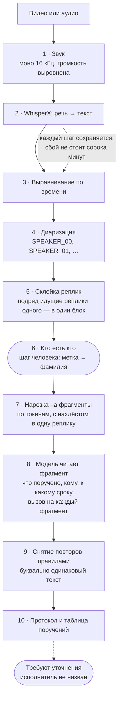

# Как это работает

Подробности для тех, кто разбирается в устройстве. Обзор — в [README](../README.md), установка — в [QUICKSTART](../QUICKSTART.md).

## Как проходят данные

Модель вызывается столько раз, сколько получилось фрагментов: на часовом
совещании с окном в 8k это обычно четыре-шесть запросов. Сводятся их
результаты **не моделью, а правилами** — тем и объясняется, что повторы
снимаются только буквальные.

### Нарезка нужна не всегда

Она существует ровно потому, что стенограмма не влезает в окно модели. Из
этого растёт и всё остальное: нахлёст — чтобы не терять поручение, разбитое
на две реплики на границе фрагментов; снятие повторов — чтобы нахлёст не
двоил результат.

Размер окна задаётся параметром `llm_context_tokens`, и от него всё зависит:

| Окно | Что происходит |
|---|---|
| 8k, местная 7B | 4–6 фрагментов, нахлёст, снятие повторов |
| 32k | один-два фрагмента |
| 128k и больше | фрагмент один: часовое совещание это тысяч двадцать токенов |

При большом окне модель видит весь разговор сразу: повторов не возникает по
построению, и контекст у неё полный — она понимает, что «план по
справочникам» в начале и в конце это одно и то же поручение.

Соблазн очевиден, и всё же по умолчанию здесь местная модель с тесным окном.
Большое окно сегодня означает облако, а инструмент обещает, что запись и
стенограмма не покидают машину. Для совещания с внутренней кухней это не
украшение, а условие допуска: отправить стенограмму наружу — значит отменить
единственную причину, по которой инструментом можно пользоваться.

Поэтому окно — параметр, а не выбор архитектуры. Код один и тот же.

### Что вытягивает малую модель

Если цель — обойтись местной 7B, помогает вот что, по убыванию отдачи:

* **Пример в промпте.** Малая модель держит формат заметно устойчивее, когда
  видит образец ответа. Он в промпте есть, и в нём нарочно показано
  поручение без исполнителя — чтобы «не указано» выглядело допустимым
  ответом, а не поводом выдумать фамилию.
* **Фрагменты поменьше.** Против интуиции: на длинном куске малая модель
  начинает терять поручения из середины. Для этого и оставлен
  `chunk_max_tokens` — задать бюджет вручную, меньше расчётного.
* **Строки вместо JSON.** Структуру она ломает на первом же длинном тексте,
  а `Поручение: … Кому: … Срок: …` держит.
* **Низкая температура.** Задача извлекающая: поручение надо найти в тексте,
  а не сочинить похожее.

## Кто есть кто: два источника имён

Сопоставить `SPEAKER_00` с фамилией машина не может, но может подсказать.
Источников два, и они дополняют друг друга.

**Список участников** — csv или обычный текстовый файл с ФИО и должностями.
Имена написаны верно, есть должности, есть и те, кто промолчал.

**Сама запись.** На совещаниях список участников звучит вслух: «У нас на
связи Семенов Алексей Валерьевич, первый замминистр». Инструмент вылавливает
такие представления и предлагает их. Даром и без файла — но с ошибками
распознавания: «Евгеньевна» приезжает как «Евгенина», а должность в
родительном падеже.

Поэтому оба сразу, и список главнее: если человек есть в обоих источниках,
берётся написание из списка. Совпадение ищется по фамилии — она устойчивее
отчества, которое распознавание коверкает чаще всего.

Сверх того работает догадка о порядке: ведущий называет человека и передаёт
ему слово, поэтому имя из хвоста предыдущей реплики скорее всего
принадлежит тому, кто заговорил следующим. Догадка подставляется, но
остаётся догадкой — человек видит её рядом с первой репликой и правит.

**Список участников не заменяет число говорящих.** В списке все
приглашённые, а диаризации нужно число голосов в записи: на совещании из
тридцати человек говорят обычно пятеро. Скажешь «тридцать» — получишь
тридцать спикеров, каждый реальный человек будет расщеплён на нескольких.

## Протокол и стенограмма — разные документы

Это стоит развести с самого начала, потому что путают их постоянно.

**Стенограмма** — что говорили, дословно, с отметками времени. Сырьё: по
ней возвращаются к спорному месту и проверяют, не выдумала ли модель.

**Протокол** — документ с заведённой формой, который подписывают и
рассылают. Стенограмму внутрь него не подшивают: сорок страниц расшифровки
превращают документ в то, что никто не прочтёт.

Поэтому на выходе три файла: протокол, стенограмма и таблица поручений.

### Своя форма протокола

Форма в каждой организации своя — где-то нужен номер и гриф, где-то
«СЛУШАЛИ — ВЫСТУПИЛИ — РЕШИЛИ», где-то подписи двух человек. Угадать её
снаружи нельзя, поэтому форму приносит пользователь, а инструмент
подставляет в неё то, что знает:

| Место | Чем заполняется |
|---|---|
| `{{title}}` | заголовок |
| `{{number}}` | номер протокола |
| `{{date}}` | дата и время |
| `{{place}}` | место проведения |
| `{{chair}}` | председательствующий |
| `{{secretary}}` | секретарь |
| `{{attendees}}` | участники списком, с должностями |
| `{{attendees_line}}` | участники строкой, через запятую |
| `{{tasks}}` | поручения: кто, что, к какому сроку |
| `{{tasks_table}}` | они же таблицей |
| `{{unclear}}` | поручения без названного исполнителя |
| `{{duration}}` | длительность записи |

Незнакомое место остаётся в документе как есть — это не ошибка, а подсказка
тому, кто будет дописывать его руками. Образец формы —
`data/sample/protocol_template.md`.

## Что стоит знать заранее

**Диаризация ошибается.** Она может разделить одного человека на двух — так
бывает, когда он отходит от микрофона, — или свести двоих в одного. Первое
лечится на шаге сопоставления: назначьте обеим меткам одно имя, и реплики
сольются. Второе не лечится ничем, кроме перезаписи с лучшим микрофоном.

**Реплика без метки не выбрасывается.** Если диаризация не опознала кусок,
он остаётся в стенограмме под меткой `UNKNOWN`. В списке участников его нет
и модели он как человек не предъявляется — но текст сохраняется, потому что
в нём вполне может быть суть поручения.

**Модель может придумать.** У каждого поручения сохраняется номер фрагмента,
из которого оно взято, — по нему возвращаются к месту разговора и проверяют.
Протокол, собранный автоматически, остаётся черновиком до вычитки.
